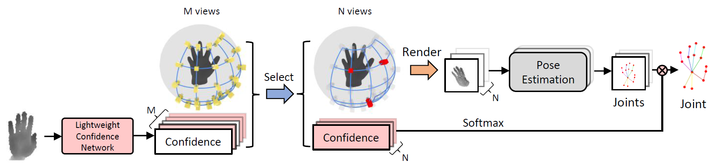

# Efficient Virtual View Selection for 3D Hand Pose Estimation

This is the official implementation for the paper, 
"Efficient Virtual View Selection for 3D Hand Pose Estimation", 
AAAI 2022.



[Project Webpage](https://me495.github.io/handpose-virtualview/) &nbsp;  &nbsp;  &nbsp;   [Paper](https://arxiv.org/pdf/2203.15458)

## Update (2022-3-30)
We upload prediction results in pixel coordinates (i.e., UVD format) for NYU and ICVL datasets: https://github.com/iscas3dv/handpose-virtualview/tree/main/result_nyu_icvl, Evaluation code (https://github.com/xinghaochen/awesome-hand-pose-estimation/tree/master/evaluation) can be applied for performance comparision among SoTA methods.

## Update (2022-6-7)
The models were damaged during uploading to Google drive. We have uploaded new models. 

## Update (2022-06-27)
Modify the training method of View selection with the "student" confidence network.

## Dependencies
* `CUDA 11.1`

Other versions of `CUDA` should also work, 
but please make sure that the version of `CUDA` used by `PyTorch` is the same as the system, 
because our code needs to be compiled with `nvcc`. 

## Installation
* Clone this repository.
* Install the required packages:
  ```angular2html
  pip install -r requirements.txt
  ```
* Compile and install the multi-view rendering code:
  ```angular2html
  cd ops/cuda/
  python setup.py install
  ```

## Data preparation
We publish training and evaluation code on NYU hand pose dataset and ICVL hand posture dataset. 
The data preparation process of these two datasets is as follows. 

### NYU Hand Pose Dataset
* Download [NYU Hand Pose Dataset](https://jonathantompson.github.io/NYU_Hand_Pose_Dataset.htm#download). Then put them under the data directory:
  ```angular2html
  -directory/
    -test/
      -joint_data.mat
      ...
    -train/
      -joint_data.mat
      ...
  ```
* Modify `path` field of the `config/dataset/nyu.json` to point to the data directory. 

### ICVL Hand Posture Dataset
* Download [ICVL Hand Posture Dataset](https://labicvl.github.io/hand.html). Then put them under the data directory:
  ```angular2html
  -directory/
    -Testing/
      -Depth/
        ...
      -test_seq_1.txt
      -test_seq_2.txt
    -Training/
      -Depth/
        ...
      -labels.txt
  ```
* Modify `path` field of the `config/dataset/icvl.json` to point to the data directory.


## Evaluation
We have already trained some models that you can [download](https://drive.google.com/file/d/1kfrfLUKynVNH5W8iD2UHLllGUG-aAJtv/view?usp=sharing) and evaluate. 
After downloading models, extract it to `checkpoint` folder in the project directory.

### NYU Hand Pose Dataset
#### Uniform sampling
In the output results, `error_3d_conf` shows the average joint error for fusion with confidence, 
and `error_3d_fused` shows the average joint error for fusion without confidence.
* Uniformly sampling 25 views:
  ```angular2html
  python train_a2j.py --config config/nyu/eval_uniform25.yaml
  ```
* Uniformly sampling 15 views:
  ```angular2html
  python train_a2j.py --config config/nyu/eval_uniform15.yaml
  ```
* Uniformly sampling 9 views:
  ```angular2html
  python train_a2j.py --config config/nyu/eval_uniform9.yaml
  ```
* Uniformly sampling 3 views:
  ```angular2html
  python train_a2j.py --config config/nyu/eval_uniform3.yaml
  ```
* Uniformly sampling 1 views:
  ```angular2html
  python train_a2j.py --config config/nyu/eval_uniform1.yaml
  ```

#### View selection with the “teacher” confidence network
In the output results, `error_3d_fused` shows the average joint error.
* Select 15 views from 25 views:
  ```angular2html
  python train_a2j.py --config config/nyu/eval_25select15.yaml
  ```
* Select 9 views from 25 views:
  ```angular2html
  python train_a2j.py --config config/nyu/eval_25select9.yaml
  ```
* Select 3 views from 25 views:
  ```angular2html
  python train_a2j.py --config config/nyu/eval_25select3.yaml
  ```
* Select 1 view from 25 views:
  ```angular2html
  python train_a2j.py --config config/nyu/eval_25select1.yaml
  ```

#### View selection with the “student” confidence network
In the output results, `epoch_error_3d_conf_select` shows the average joint error.
* Select 15 views from 25 views:
  ```angular2html
  python view_select_a2j.py --config config/nyu/eval_25select15_light.yaml
  ```
* Select 9 views from 25 views:
  ```angular2html
  python view_select_a2j.py --config config/nyu/eval_25select9_light.yaml
  ```
* Select 3 views from 25 views:
  ```angular2html
  python view_select_a2j.py --config config/nyu/eval_25select3_light.yaml
  ```
* Select 1 view from 25 views:
  ```angular2html
  python view_select_a2j.py --config config/nyu/eval_25select1_light.yaml
  ```

### ICVL Hand Posture Dataset
We provide a model trained and configuration files on ICVL hand posture dataset, 
you can follow the commands on NYU hand pose dataset and use corresponding configuration files to evaluate.


## Training
You can also train models using the following commands.

### NYU Hand Pose Dataset
#### Uniform sampling
We only train a model that uniformly samples 25 views, 
which is also suitable for uniformly sampling 15, 9, 3 and 1 views.
```angular2html
python train_a2j.py --config config/nyu/train_uniform.yaml
```

#### View selection with the “teacher” confidence network
The following commands train models using the "teacher" network to select 15, 9, 3 views from 25 views respectively.
The model that selects 1 view from 25 views is the same as the model that selects 3 views from 25 views. 
```angular2html
python train_a2j.py --config config/nyu/train_25select15.yaml
```
```angular2html
python train_a2j.py --config config/nyu/train_25select9.yaml
```
```angular2html
python train_a2j.py --config config/nyu/train_25select3.yaml
```

#### View selection with the “student” confidence network
The following commands train models using the "student" network to select 15, 9, 3 views from 25 views respectively.
The model that selects 1 view from 25 views is the same as the model that selects 3 views from 25 views. 
This step requires the use of the trained `teacher` confidence network, 
please modify the `pre_a2j` field of the configuration file to the path of the previously trained model.
```angular2html
python view_select_a2j.py --config config/nyu/train_25select15_light.yaml
```
```angular2html
python view_select_a2j.py --config config/nyu/train_25select9_light.yaml
```
```angular2html
python view_select_a2j.py --config config/nyu/train_25select3_light.yaml
```

### ICVL Hand Posture Dataset
We provide configuration files on ICVL hand posture dataset, 
you can follow the commands on NYU hand pose dataset and use corresponding configuration files to train.

## Citation
Please cite this paper if you want to use it in your work,
```angular2html
@inproceedings{Cheng2022virtualview,
      title={Efficient Virtual View Selection for 3D Hand Pose Estimation}, 
      author={Jian Cheng, Yanguang Wan, Dexin Zuo, Cuixia Ma, Jian Gu, Ping Tan, Hongan Wang, Xiaoming Deng, Yinda Zhang}, 
      booktitle={AAAI Conference on Artificial Intelligence (AAAI)}, 
      year={2022} 
} 
```

## Acknowledgements
We use part of the great code from [A2J](https://github.com/zhangboshen/A2J), 
[HandAugment](https://github.com/wozhangzhaohui/HandAugment) 
and [attention-is-all-you-need-pytorch](https://github.com/jadore801120/attention-is-all-you-need-pytorch).
